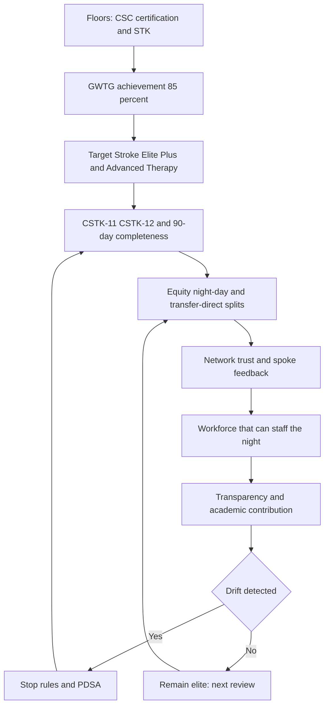

# Becoming and Remaining Elite

## Opening

Elite, for an academic Comprehensive Stroke Center, is not a marketing adjective and not a trophy wall. It is a durable state in which the right patients receive guideline-directed care at night as well as by day, outcomes are known rather than assumed, equity gaps are treated as defects, the region trusts the hub, people with other job options still choose to work there, and the center's practice and teaching influence care beyond its own walls. Certification and awards can follow that state. They cannot create it.

The Medical Director's job is to define elite in operational terms, to instrument it, and to refuse the counterfeit: a Gold award over incomplete 90-day mRS, a destination campaign over a red ICU, a visiting-professor calendar over a night roster that is one resignation from collapse. Recognition is a lagging indicator. The leading indicators are reliability, completeness, equity, network behavior, workforce stability, and the academic contribution that changes someone else's protocol.

Remaining elite is harder than becoming visible. Systems drift. Volume rises. Coordinators are cut after the plaque arrives. A TSC in the region grows up. A scanner fails. A fellowship year is weak. The excellence system is the set of reviews, stop rules, and public-facing truths that detect drift while it is still reversible.

Write a definition the board cannot put on a billboard without also funding nights, follow-up, and honesty.

## Why This Matters

Published therapies only help patients who receive them. The 2026 AHA/ASA AIS Guideline requires rapid IV thrombolysis for eligible disabling deficits within 4.5 hours regardless of NIHSS, using tenecteplase 0.25 mg/kg (max 25 mg) or alteplase 0.9 mg/kg (max 90 mg), and it requires that patients eligible for both IVT and EVT receive both without delaying thrombectomy. HERMES quantified EVT benefit when systems delivered it (mRS 0–2 in 46.0% versus 26.5%; NNT 2.6 for at least a one-point mRS shift). Late-window and large-core trials expanded who can benefit, which expands who is harmed by an unreliable chain. Elite is the ability to deliver that chain every night, not the ability to cite the trials.

Hemorrhagic excellence is part of the same definition. The 2022 ICH Guideline, the 2024 ICH performance measures, and the 2023 aSAH Guideline are operational documents. CSTK-03, CSTK-04, and CSTK-06 are how an elite center proves hemorrhagic care is a system. The April 2, 2025 Joint Commission announcement reduced the annual aSAH volume criterion to 10; an elite center treats that as a floor and measures securing times, nimodipine reliability, and delayed-ischemia surveillance instead of celebrating eligibility.

Measures already exist. GWTG-Stroke achievement requires 85% on each of seven measures, with Bronze at 90 consecutive days, Silver at 12 months, and Gold at 24 months. Target: Stroke Honor Roll is 75% DTN ≤60 min; Elite is 85% DTN ≤60 min; Elite Plus is 75% DTN ≤45 min and 50% DTN ≤30 min; Advanced Therapy is 50% door-to-device ≤90 min direct and ≤60 min transfer. Target: Type 2 Diabetes requires a composite ≥80% for 12 months. Target: Stroke Phase III national goals match the Elite and Advanced Therapy primary goals. CSTK-11 and CSTK-12 measure rapid effective reperfusion (TICI ≥2B within 120 min of arrival and within 60 min of puncture). CSTK-02 and CSTK-10 measure whether 90-day outcomes are even known. An elite center uses these as instruments, then adds equity strata, night-versus-day splits, network trust, and workforce measures that no award currently requires.

Academic influence without clinical reliability is decoration. Visiting observers, guideline comments, and multicenter trial leadership are legitimate elite functions only if the host service is safe to watch. The posture is hospitality and contribution, not celebrity.

## Core Framework

### A definition that cannot be used as a slogan

If a dimension is missing, do not use the word elite.

| Dimension | Operational meaning | Counterfeit |
| --- | --- | --- |
| Outcomes | 90-day mRS known for the CSTK-02 population; CSTK-10 interpreted with completeness, not only among those easy to reach | Quoting trial rates from a 40% follow-up sample |
| Reliability | Night and day DTN, door-to-device, CSTK-11/12, ICH reversal, and aneurysm-securing clocks hold under ordinary load | A good quarter used as a campaign |
| Equity | Same clocks and same treatment opportunity across the strata the quality system tracks | A single blended rate |
| Academic influence | Protocols, teaching, trials, and written contributions others actually use | A brochure of famous visitors |
| Network trust | Spokes send the right patients, get feedback, and would still call after a disagreement | Inbound volume |
| Workforce | People can staff the night without heroics and would recommend the job | Retention bonuses after a collapse |
| Transparency | Defects are visible internally and, where required or promised, externally | Award press releases without denominators |

### Benchmarking stack

Stack measures from floor to internal aim. Label each layer so nobody "manages to the plaque."

| Layer | Instrument | What it is | Elite use |
| --- | --- | --- | --- |
| Certification floor | Joint Commission CSC standards, current E-App volumes, required CSTK/STK submission | Permission to operate as a CSC | Confirm current numbers; do not advertise floors |
| Inpatient process floor | STK-1, 2, 3, 4, 5, 6, 8, 10 | Longstanding core inpatient set | Fallouts are still defects at an elite center |
| Registry achievement | GWTG achievement at 85% on each of seven measures for the required duration | Bronze / Silver / Gold | Necessary, not sufficient |
| Speed recognition | Target: Stroke Honor Roll / Elite / Elite Plus | DTN distributions | Elite Plus is an external benchmark, not the identity |
| Device recognition | Target: Stroke Advanced Therapy | Door-to-device 50% ≤90 min direct / ≤60 min transfer | Pair with CSTK-11/12 |
| Diabetes recognition | Target: Type 2 Diabetes composite ≥80% for 12 months | Composite process | Include; do not ignore because it is not reperfusion |
| Reperfusion effectiveness | CSTK-08, CSTK-09, CSTK-11, CSTK-12 | Grade and speed of effective reperfusion | The academic CSC's distinctive reliability set |
| Outcome completeness | CSTK-02; CSTK-10 | 90-day mRS known; favorable-outcome rate among those measured | Completeness is the first outcome measure |
| Hemorrhage reliability | CSTK-03, CSTK-04, CSTK-05, CSTK-06 | Severity, reversal, hemorrhagic transformation, nimodipine | Elite includes hemorrhage |
| Internal aims | Night/day, transfer/direct, equity strata, ICU boarding, clinic access | Not on the award application | How elite is managed weekly |
| Network aims | Accept clock, feedback completion, treat-in-place quality | Not on the award application | How elite looks from a spoke |
| Workforce aims | Vacancy, after-hours extra shifts, safety voice | Not on the award application | How elite survives the next year |

Do not invent numeric EVT or IVT volume requirements. Confirm the current E-App. Historical summaries that cited figures such as 25 IV thrombolysis cases are historical. The aSAH criterion is the April 2, 2025 announcement reducing the annual volume criterion to 10—still a floor.

### Recognition as a lagging indicator

Apply for awards. Do not manage by them.

| Recognition | What it can say | What it cannot say | Stewardship rule |
| --- | --- | --- | --- |
| TJC CSC certification | The program met standards, guidelines, and measurement requirements at survey | That last Tuesday night was safe | Recertification is maintenance, not a peak |
| GWTG Gold | Achievement measures held 24 months at 85% each | That 90-day mRS is complete or that nights equal days | Do not cut coordinator FTE after Gold |
| Target: Stroke Elite Plus | DTN distribution met published thresholds in the award window | That CSTK-11 is intact or that ICH reversal is timely | Keep Elite Plus subordinate to the full stack |
| Advanced Therapy | Door-to-device distribution met published thresholds | That selection was appropriate or that TICI ≥2B was timely from arrival | Read next to CSTK-11/12 |
| Plus / quality add-ons | Additional GWTG quality measures | Equity or network trust | Still lagging |
| Media lists and "best of" | Marketing | Anything operational | Do not put them in the quality minutes |

When an award is lost or missed, treat it as a signal to inspect the leading indicators. When an award is won, inspect the same indicators before anyone drafts a press note. The press note, if any, should be written by communications after quality has released the denominators.

### Academic and international posture without celebrity

An academic CSC owes the field more than its own registry. That obligation has a sequence.

| Posture | What good looks like | What to refuse |
| --- | --- | --- |
| Visiting observers | A defined observational pathway, consent of patients, and a host who is not also running the only night board | Using visitors as unpaid labor or as décor for a weak service |
| Outbound teaching | Protocols and drills that a spoke or a foreign team can run without the original personalities | Slide decks that cannot survive contact with a night ED |
| Guideline contribution | Comments, evidence reviews, and local data shared through proper channels | Name-dropping and implying authorship the faculty do not have |
| Trial leadership | StrokeNet and other multicenter work with real screening | Opening trials the coordinator FTE cannot support |
| Publication | Defects and negative findings as well as series of successes | Case series timed to a marketing campaign |
| Hosting international visitors | Clear objectives, language support, and a view of nights, ICU, and M&M—not only the biplane | A daytime tour that hides the envelope |

Do not name individuals as if the center's elite status were a personality. Build roles that survive a sabbatical.

### Multi-year excellence system

Excellence is a calendar, not a mood.

| Horizon | Reliability work | People work | Academic work | Stop rule |
| --- | --- | --- | --- | --- |
| This quarter | Close one CSTK or Target: Stroke defect type; complete 90-day contacts | One workforce risk (call, vacancy, safety voice) | One protocol or teaching product someone else can use | If two leading indicators are red, no new award campaign or visitor program |
| This year | Hold Elite Plus / Advanced Therapy benchmarks without trading hemorrhage or equity | Night staffing that does not depend on a single person | StrokeNet screening as a pathway; fellowship case-mix review | If Gold depends on heroics, refuse the heroics and accept the missed plaque |
| Years 2–3 | Internal aims tighter than published thresholds only if the envelope holds | Succession for Medical Director, coordinators, and IR/NCC nights | Observational hosting and guideline-level contribution | If network trust falls, freeze destination marketing |
| Ongoing | After-action on every downtime and every harm | Psychological safety as a measured object | Transparency of methods | If completeness of CSTK-02 falls, outcome claims stop |

High-reliability habits are the daily method: preoccupation with failure, reluctance to simplify, sensitivity to operations, commitment to resilience, deference to expertise. IHI Model for Improvement and PDSA turn those habits into tests. CUSP turns them into unit-level voice. None of that is compatible with a culture that punishes the person who reports a missed DTN in award season.

!!! tip "Key Actions"
    Write a one-page elite definition with the seven dimensions and the counterfeit of each. Put CSTK-02 completeness beside every outcome slide. Split DTN, door-to-device, CSTK-11, and CSTK-12 by night versus day and by transfer versus direct. Add one equity stratum and one workforce measure to the same dashboard that shows GWTG. Treat award applications as a quality-operations task with a freeze if leading indicators are red. If observers are hosted, show them nights and M&M, not only the suite.

!!! abstract "Metrics Targets"
    Use published external benchmarks exactly: GWTG achievement 85% on each of seven measures (Bronze 90 days, Silver 12 months, Gold 24 months); Target: Stroke Honor Roll 75% DTN ≤60 min; Elite 85% DTN ≤60 min; Elite Plus 75% DTN ≤45 min and 50% DTN ≤30 min; Advanced Therapy 50% door-to-device ≤90 min direct / ≤60 min transfer; Target: Type 2 Diabetes composite ≥80% for 12 months. Manage CSTK-11 (TICI ≥2B within 120 min of arrival) and CSTK-12 (TICI ≥2B within 60 min of puncture) as core elite reliability measures. Set an internal CSTK-02 completeness aim that makes CSTK-10 interpretable; do not publish favorable-outcome rates from a thin follow-up sample. Add internal night/day ratios, equity gaps, accept-clock performance, and a workforce signal. Certification volume floors are confirmed in the current E-App, not invented.

!!! warning "Common Pitfalls"
    Using "elite" as a brand before nights are reliable. Managing only DTN because it is on the award. Quoting 90-day independence from an incomplete cohort. Cutting quality FTE after Gold. Hiding hemorrhage measures behind reperfusion success. Hosting international visitors while the ICU is boarding. Treating a missed award as a communications crisis rather than a reliability signal. Chasing Phase III national goals with a red capacity node. Allowing a single famous faculty member to personify the program. Press-releasing Advanced Therapy while CSTK-11 is falling.

!!! success "Implementation Tips"
    Put the seven-dimension definition on page one of the annual quality report so awards appear later, as they should. Assign an Associate Medical Director to completeness of 90-day mRS as if it were a clinical service. Review one night-versus-day defect in every operations huddle during award season so the season does not suppress reporting. When Gold arrives, present the leading-indicator risks in the same meeting as the plaque. Offer spokes the same definition of elite and ask which dimension they do not believe yet. Build observer weeks around the ordinary Tuesday, not around a showcase case.

## How to Do the Work

### Daily / weekly

Manage the leading indicators. Read night DTN and door-to-device, ICH reversal times, IR conflicts, ICU boarding, and any incomplete 90-day contacts due this week. Awards will take care of themselves if these hold; they will lie if these do not.

Protect reporting culture during award windows. A suppressed defect is a future public failure. Thank the person who brings the ugly case.

If an observer or a visiting team is in the building, assign a host who can leave the clinical board. Do not make hospitality compete with a code stroke.

### Monthly / quarterly

Review the full stack, not the award subset. Include STK fallouts, GWTG achievement, Target: Stroke distributions, Advanced Therapy, CSTK-08 through CSTK-12, CSTK-02 completeness, CSTK-10 with a completeness footnote, hemorrhage measures, equity strata, network measures, and workforce.

Decide whether any external recognition will be applied for. If two leading indicators are red, write the decision to wait.

Compare night and day, direct and transfer, and the equity strata. Elite that exists only from 08:00 to 17:00 for direct arrivals from one geography is not elite.

Review academic products: protocols exported, trials screened, observers hosted, teaching delivered at spokes. Kill products that consume time without changing anyone's night behavior.

### Annual / multi-year

Rewrite the elite definition if the service lines changed. A new EVT competitor, a new MSU, or a new ICU model changes what reliability means.

Reconfirm certification criteria from the current manual. Rebuild any document that still treats historical IVT counts as current requirements or that treats the aSAH floor of 10 as an achievement.

Plan recognition as a calendar: data lock, validation, application, and a communications embargo until quality releases denominators.

Plan academic contribution as a calendar: one protocol or data product the field can use, one honest outcomes report with completeness visible, and a hosting posture that can survive a survey week.

Reassess workforce. If people do not want to work there, the other six dimensions will fail next year. That finding belongs in the same session as GWTG.

Run the excellence system against [growth](32-strategy-growth.md), [network](33-network-leadership.md), [stewardship](34-financial-stewardship.md), and [continuity](35-disaster-surge.md). Elite that cannot refuse unsafe growth, cannot tell spokes the truth, cannot fund nights, or cannot run code stroke on paper is a costume.

## Ready-to-Adapt Tools

### Seven-dimension elite scorecard

| Dimension | Leading measure | External benchmark if any | Internal aim | Color | Owner |
| --- | --- | --- | --- | --- | --- |
| Outcomes | CSTK-02 completeness; CSTK-10 with footnote | CSTK specifications |  |  |  |
| Reliability | Night DTN; CSTK-11; CSTK-12; CSTK-04 | Elite Plus; Advanced Therapy; CSTK |  |  |  |
| Equity | Clock gap across defined strata | None required |  |  |  |
| Academic influence | Exported protocol or trial screening rate | None |  |  |  |
| Network trust | Feedback completion; spoke critique | None |  |  |  |
| Workforce | Vacancy; extra-shift dependence; safety-voice events | None |  |  |  |
| Transparency | Public or regional reports with denominators | Award rules if claiming an award |  |  |  |

### Award-season gate

Do not submit if any box is unchecked.

1. Achievement and Target: Stroke numerators validated against current GWTG criteria.
2. CSTK-02 completeness at the internal aim.
3. Night-versus-day reliability reviewed; no hidden night collapse.
4. Hemorrhage measures reviewed, not only reperfusion.
5. Equity stratum reviewed.
6. Coordinator overtime is not the only reason the data exist.
7. Communications embargo in place.
8. Medical Director sign-off after seeing the red items.

### Observer-week skeleton

| Day | See | Do not substitute |
| --- | --- | --- |
| 1 | ED door, CT, pharmacy, paper downtime card | Conference room only |
| 2 | IR path, emergency-preemption rule, CSTK-11/12 review | Showcase elective only |
| 3 | ICU ICH/aSAH bundle, nimodipine pathway | Rounds without the night handoff |
| 4 | Quality meeting, 90-day method, equity slide | Award slide deck |
| 5 | Spoke feedback call or telestroke sitting | Marketing tour |

Local privacy, credentialing, and visitor policies govern. This is a host agenda, not a privilege to perform care.

### Multi-year excellence calendar

| Quarter | Reliability | Recognition | Academic | Workforce |
| --- | --- | --- | --- | --- |
| Q1 | Night/day deep dive | Validate prior-year GWTG | Choose one exportable protocol | Call-grid stress test |
| Q2 | CSTK-11/12 and hemorrhage | Decide applications | Observer policy refresh | Safety-voice audit |
| Q3 | Equity and clinic access | Data lock if applying | Trial portfolio prune | Succession review |
| Q4 | Continuity tabletop plus after-action | Communications only after quality release | Annual honest outcomes note | Retention and training plan |

### RACI for elite claims

| Decision | Medical Director | Quality director | Communications | Chair | Network lead |
| --- | --- | --- | --- | --- | --- |
| Elite definition | A | R | I | C | C |
| Award submission | A | R | I | I | I |
| External use of the word elite | A | C | R | C | C |
| Outcome publication | A | R | C | C | I |
| Observer hosting | A | C | I | I | C |

## Integration With Other Pillars

This chapter is the test of the rest of Part VII. [Strategy](32-strategy-growth.md) decides whether growth is allowed to destroy reliability. [Network leadership](33-network-leadership.md) decides whether elite is visible from a spoke. [Financial stewardship](34-financial-stewardship.md) decides whether nights and coordinators are funded without invented payback stories. [Disaster and surge](35-disaster-surge.md) decides whether elite survives a dark scanner.

Upstream, leadership, culture, and FTE architecture decide whether anyone can tell the truth in award season. Clinical pathways are the content being timed. Quality infrastructure, improvement methods, survey readiness, and equity work are the instruments. Education and research are how influence becomes real rather than ceremonial.

If a communications draft and the seven-dimension definition disagree, the definition wins.

## Sources

- 2026 Guideline for the Early Management of Patients With Acute Ischemic Stroke. *Stroke*. 2026;57(8):e316–e436. DOI 10.1161/STR.0000000000000513.
- Greenberg SM, et al. 2022 Guideline for the Management of Patients With Spontaneous Intracerebral Hemorrhage. *Stroke*. 2022. DOI 10.1161/STR.0000000000000407.
- Hoh BL, et al. 2023 Guideline for the Management of Patients With Aneurysmal Subarachnoid Hemorrhage. *Stroke*. 2023;54:e314–e370. DOI 10.1161/STR.0000000000000436.
- 2024 AHA/ASA Performance and Quality Measures for Spontaneous ICH.
- Kleindorfer DO, et al. 2021 Guideline for the Prevention of Stroke in Patients With Stroke and Transient Ischemic Attack. *Stroke*. 2021.
- Joint Commission DSC certification (standards, clinical practice guidelines, performance measurement); 2026 Stroke Certification Standards (SCS26); active E-App. April 2, 2025 announcement reducing the annual aSAH volume criterion to 10.
- Specifications Manual for Joint Commission National Quality Measures, CSTK v2026B (posted 02/06/2026; 3Q–4Q 2026 discharges): CSTK-01 through CSTK-06 and CSTK-08 through CSTK-12. CSTK-07 is not in the current set.
- STK core inpatient set (STK-1, 2, 3, 4, 5, 6, 8, 10); STK-OP v2026B exists for outpatient/ED stroke. Confirm current CMS OQR content rather than asserting historical OP-23 as still mandatory.
- GWTG-Stroke recognition criteria as published by AHA (public page last reviewed September 9, 2022): 85% on each of seven achievement measures; Bronze 90 days, Silver 12 months, Gold 24 months; Target: Stroke Honor Roll / Elite / Elite Plus / Advanced Therapy; Target: Type 2 Diabetes ≥80% for 12 months; Phase III national goals matching Elite / Advanced Therapy primary goals.
- Goyal M, et al. HERMES collaboration. *Lancet*. 2016. mRS 0–2 46.0% vs 26.5%; NNT 2.6.
- Alberts MJ, et al. Recommendations for Comprehensive Stroke Centers. *Stroke*. 2005. Foundational, not a substitute for current CSC standards.
- Landmark trials used operationally: NINDS tPA; ECASS III; MR CLEAN, ESCAPE, EXTEND-IA, SWIFT PRIME, REVASCAT; DAWN; DEFUSE 3; SELECT2; ANGEL-ASPECT; RESCUE-Japan LIMIT; EXTEND-IA TNK; CHANCE; POINT; INTERACT2; ENCHANTED2; INTERACT3.
- NIH StrokeNet.
- IHI Model for Improvement; AHRQ CUSP; high-reliability organizing principles.
